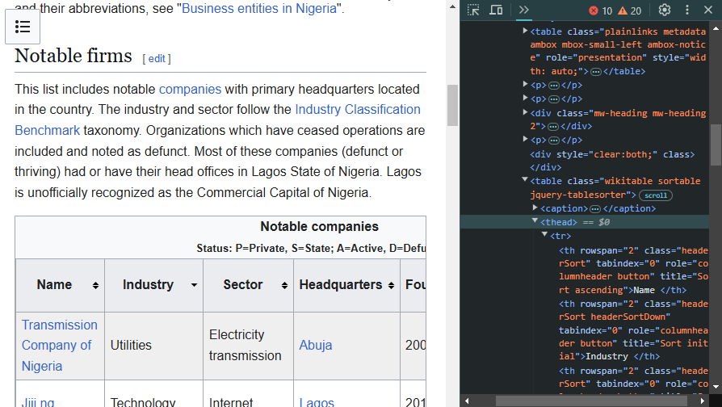
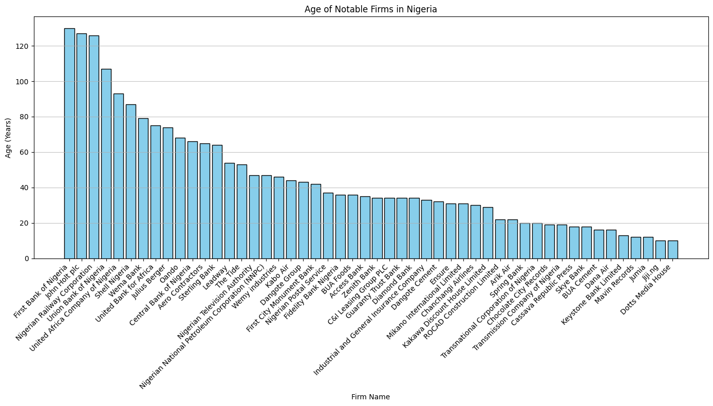
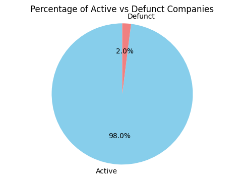
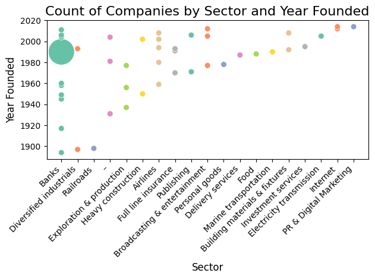

# Webscraping and Analyzing Data on Notable Firms in Nigeria



---

## Introduction

I have been tasked by a Nigerian government parastatal with gathering data from a federal government website that contains information about various notable firms in Nigeria, dating back to the 1890s. The objective is to create a visual representation of these firms' ages and analyze how many of them are still active, among other insights. To achieve this, I will employ web scraping techniques, HTML manipulation, and Python for data analysis and visualization—all within [this Jupyter Notebook](webscrape%20(1).ipynb).

---

## Problem Statement

- What is the comparative age distribution of the notable firms?
- What percentage of them are inactive?
- What is the number of companies (by sector) established each year?

---

## Skills/Concepts Demonstrated

- Webscraping  
- HTML Manipulation  
- Python Analytics and Visualization
- For Loops

---

## Data Sourcing and Description

### Sourcing

The data was scraped from an HTML table on this [Wikipedia page](https://en.wikipedia.org/wiki/List_of_companies_of_Nigeria) into a Jupyter Notebook and then converted into a Pandas DataFrame. The HTML table consists of a real-world dataset with 51 rows and 7 columns, described as follows:

---

### Description of Data Columns

| **Column**      | **Description**                                          |
|-----------------|----------------------------------------------------------|
| Name            | The name of the firm.                                    |
| Industry        | The industry to which the firm belongs.                  |
| Sector          | The sector the firm belongs to.                          |
| Headquarters    | The location of the firm's headquarters in Nigeria.      |
| Founded         | The year the firm was founded.                           |
| Note            | Additional information about the firm.                   |
| Private/State   | Indicates whether the firm is private ('P') or state-owned ('S'). |
| Active/Defunct  | Indicates whether the firm is active ('A') or defunct ('D'). |

---

## Methodology and Findings

### Methodology

#### Libraries and Modules Used

The following libraries were imported into the Jupyter Notebook to perform web scraping, data manipulation, and analysis:

```python
from bs4 import BeautifulSoup
import requests
import pandas as pd
import lxml
print('All libraries were installed')
```

- **requests**: To get the HTML content of the webpage.
- **BeautifulSoup**: For parsing the content using the `lxml` parser.
- **lxml**: The parser found to be the most suitable for this task.
- **pandas**: To create DataFrames for convenient data manipulation and analysis.

---

#### Scraping the Raw HTML Table Content

To extract the desired table from the webpage, I used the [Inspect Element] option to identify the HTML structure. The table was classified as `wikitable sortable`, which allowed me to extract it using the following code:

```python
url = 'https://en.wikipedia.org/wiki/List_of_companies_of_Nigeria'
response = requests.get(url)
soup = BeautifulSoup(response.content, 'lxml')
Table1 = soup.find_all('table', class_="wikitable sortable")
Table1
```
[click here to view the HTML Table](html_output.html)

---

#### Getting Table Headers and Body

The following code was used to retrieve the table headers:

```python
ths = soup.find_all('th')
header_texts = [th.text.strip() for th in ths] 
first_seven_ths = ths[:7]  # Extracting first seven headers (Name to Status)
table_head = [th.text.strip() for th in first_seven_ths]
print(table_head)
```
[click here to view the screenshot containing this code's output](table_headers.png)

Because of some `== $0` elements in the HTML structure (as noticeable from the first image in this documentation), it was difficult to extract the table body using conventional methods. Instead, I copied the table's raw HTML content into a variable `tbody_html_content`, then parsed and iterated through it using a `for loop` to extract only the text as a one  dimensional list '`cells`' which was converted into a 2d list as '`celldata`' for recognition by the PandasDataframe.

```python
soup2 = BeautifulSoup(tbody_html_content, 'lxml') #parsing the html-content with lxml
headers = ['Name', 'Industry', 'Sector', 'Headquarters', 'Founded', 'Notes', 'Private/State', 'Active/Defunct'] #edited the extracted headers
table_data = []
for row in soup2.find('tbody').find_all('tr'): 
    cells = [td.text.strip() for td in row.find_all('td')]
    print (cells)
```
---
`'celldata'` was then converted into a DataFrame, making it ready for analysis.
```python
df = pd.DataFrame(celldata, columns=headers)
df.head(30) # to get the first 30 rows
```
[click here to view the resulting Data Frame](df_glimpse.png)

---

#### Data Wrangling

To prepare the data for visualization, I sorted the rows by the "Founded" year in ascending order, used Python’s `datetime` module to fetch the current year, and created a new column called `Age`, which is the difference between the current year and the founded year:

```python
df = df.sort_values(by='Founded', ascending=True)
from datetime import datetime
import matplotlib.pyplot as plt
current_year = datetime.now().year
df['Founded'] = df['Founded'].astype(int)
df['Age'] = current_year - df['Founded']
```

Additionally, to answer the third question in the problem statement, I created a new DataFrame that grouped the data by year and sector to count the number of each of the sectors established each year:

```python
df.groupby(['Founded', 'Sector']).size().reset_index(name='Count')
```

---

#### Visualization

##### Bar Chart: Age Distribution of Notable Firms

To answer the first question (What is the comparative age distribution of the notable firms?), a bar chart was created with the following code:

```python
plt.figure(figsize=(14, 8))
plt.bar(df['Name'], df['Age'], color='skyblue', edgecolor='black')

plt.title('Age of Notable Firms in Nigeria')
plt.xlabel('Firm Name')
plt.ylabel('Age (Years)')
plt.xticks(rotation=45, ha='right')
plt.grid(axis='y', alpha=0.75)
plt.tight_layout()

plt.show()
```

---

##### Pie Chart: Percentage of Active vs Defunct Firms

To answer the second question (What percentage of firms are inactive?), a pie chart was created using the following code:

```python
status_counts = df['Active/Defunct'].value_counts()
labels = ['Active', 'Defunct']
sizes = [status_counts.get('A', 0), status_counts.get('D', 0)]

plt.figure(figsize=(6, 4))
plt.pie(sizes, labels=labels, autopct='%1.1f%%', startangle=90, colors=['skyblue', 'lightcoral'])
plt.title('Percentage of Active vs Defunct Companies')
plt.axis('equal')

plt.show()
```

---

##### Scatter Plot: Companies Established by Sector and Year

To answer the third question (What is the number of companies established by sector each year?), a scatter plot was created:

```python
import seaborn as sns
sector_year_counts = df.groupby(['Founded', 'Sector']).size().reset_index(name='Count')
sns.scatterplot(data=sector_year_counts, x='Sector', y='Founded', size='Count', 
                sizes=(50, 1000), hue='Sector', palette='Set2', legend=False, marker='o')

plt.title('Count of Companies by Sector and Year Founded', fontsize=16)
plt.xlabel('Sector', fontsize=12)
plt.ylabel('Year Founded', fontsize=12)
plt.xticks(rotation=45, ha='right')
plt.tight_layout()

plt.show()
```

---

## Findings

---

### First Visualization: Age Distribution of Firms



From the bar chart, the following insights are noticeable:

- **First Bank** is the oldest firm among the notable firms.
- **Dotts Media House** and **Jiji.ng** (an online shop) are the youngest.
- The history of Nigeria is captured in one visualization.
- **First Bank** marks the beginning of a more advanced relationship between Nigeria and England.
- The growth of international trade led to the establishment of the **Nigerian Railway Company**.
- The discovery of crude oil attracted foreign companies like **Shell**.
- The limitations of railways led to the construction of road networks by **Julius Berger**.
- The failure of many banks led to the creation of the **Central Bank of Nigeria**.

---

### Second Visualization: Active vs Defunct Firms



From the pie chart, it is clear that only **2%** of the firms are currently defunct. This is a remarkable finding, showing that the firms have weathered Nigeria's economic fluctuations.

---

### Third Visualization: Companies Established by Sector and Year



From the scatter plot, we can observe:

- More **banks** were established from the late 1800s through the last decade.
- **Airlines** started appearing after World War II, around 1945.
- **Internet and digital marketing firms** began emerging in the early 21st century, marking the start of the digital age in Nigeria.

---

## Conclusion

This project utilized Python for web scraping, HTML manipulation, data analysis, and visualization to uncover insights from a seemingly basic dataset. It highlights significant trends in the historical development of Nigeria's economy, providing a deeper understanding of the notable firms and their impact on the nation’s economic landscape.
